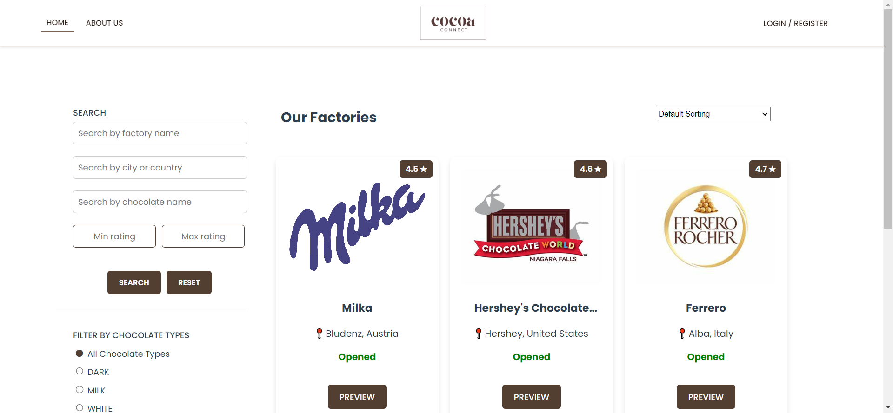
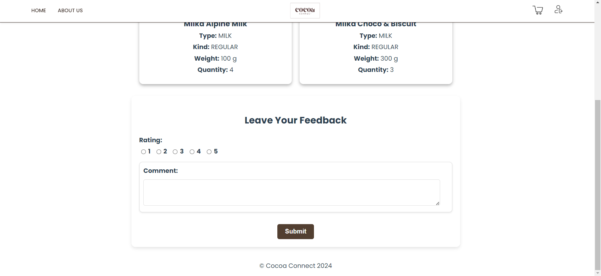

# Cocoa Connect

Academic project made for course Web Programming at Faculty of Technical Sciences, University of Novi Sad

  

## About Project

Cocoa Connect is a web application developed using JAX-RS REST(Jersey) for the backend and Vue.js for the frontend. It supports 4 different user roles: Administrator, Customer, Factory Manager and Factory Employee, each with specific funcionalities and permissions including user, factory and chocolate management, purchase handling, commenting system, and advanced search, sorting, and filtering options.

## Used Tools
► Visual Studio Code 
► Eclipse IDE for Enterprise Java and Web Developers 
► Adobe Illustrator 
► Canva 

### Authors
► Ana Edelinski 
► Anja Vujacic

## Screenshots

